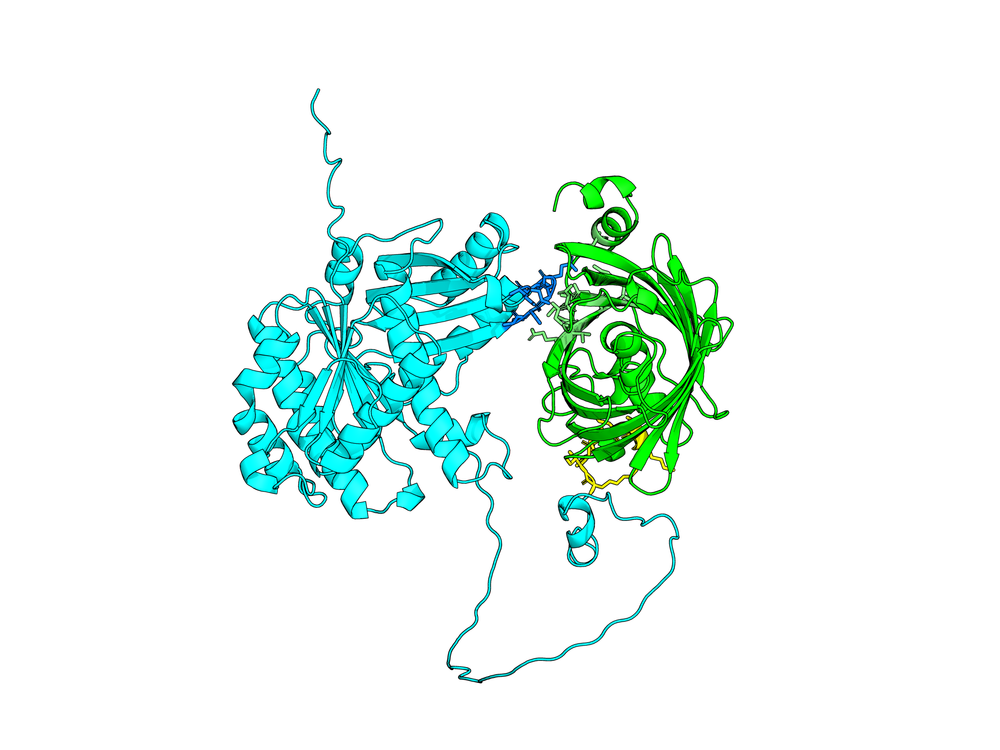

# Basic scripts for cheminformatics and protein analysis

This repo contains a collection of scripts leveraging tools like AlphaFold, ChemRDKit and PyMOL to visualize and process protein molecules.

Figure 1: *S. aureus* FtsZ-sfGFP protein fusion with flexible linker visualized with PyMOL

